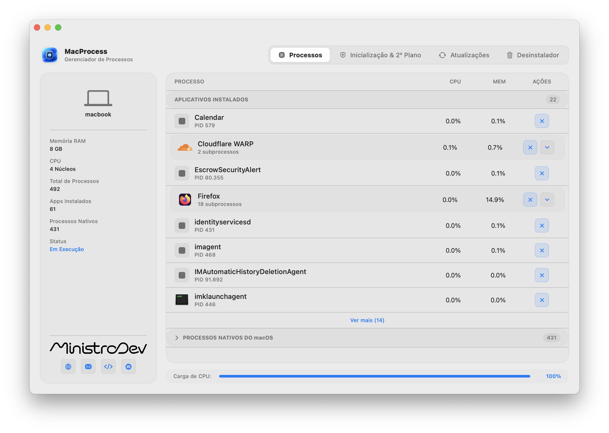
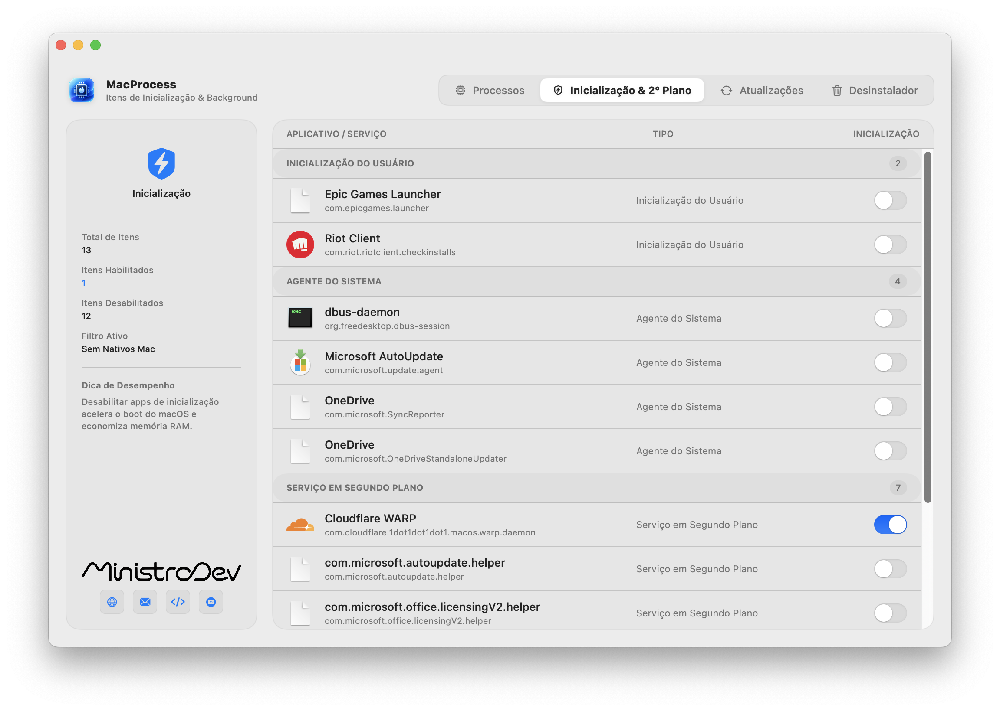
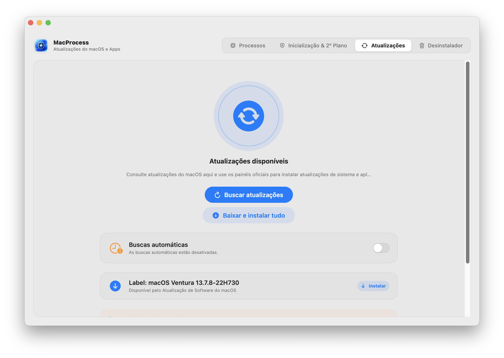
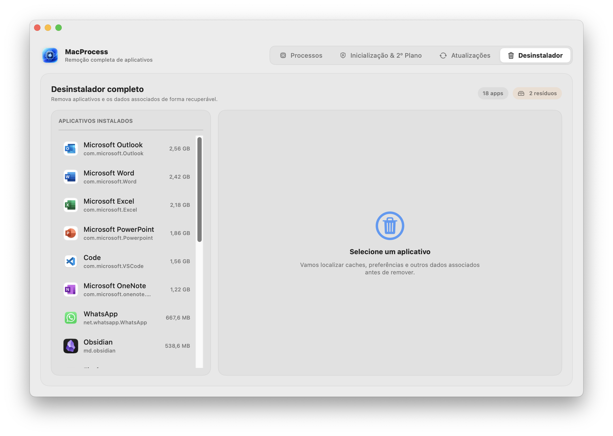
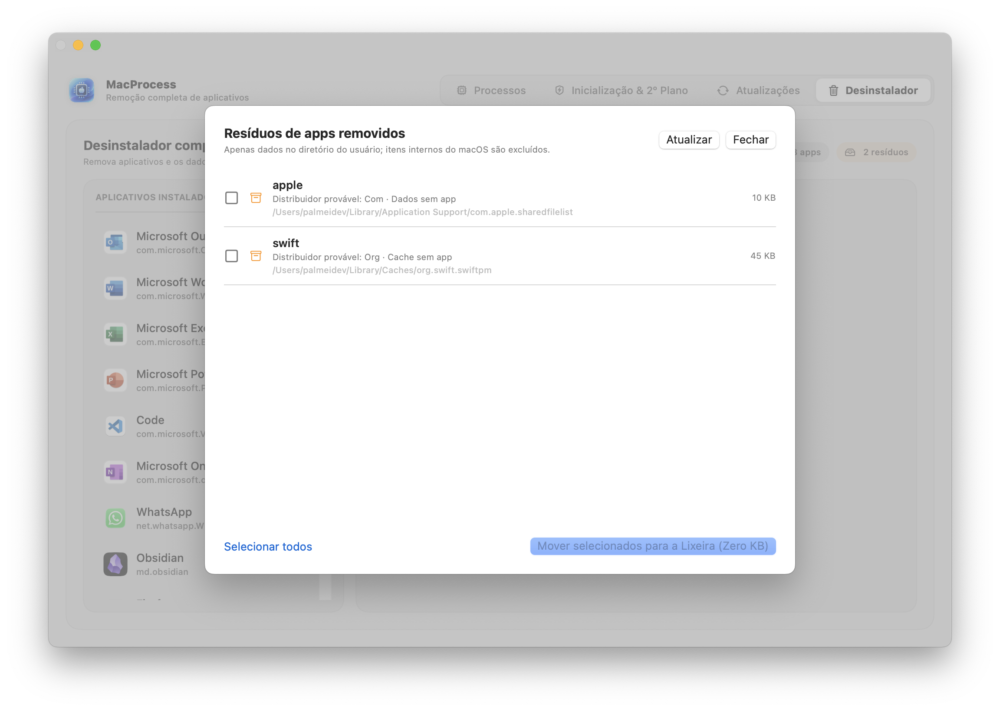
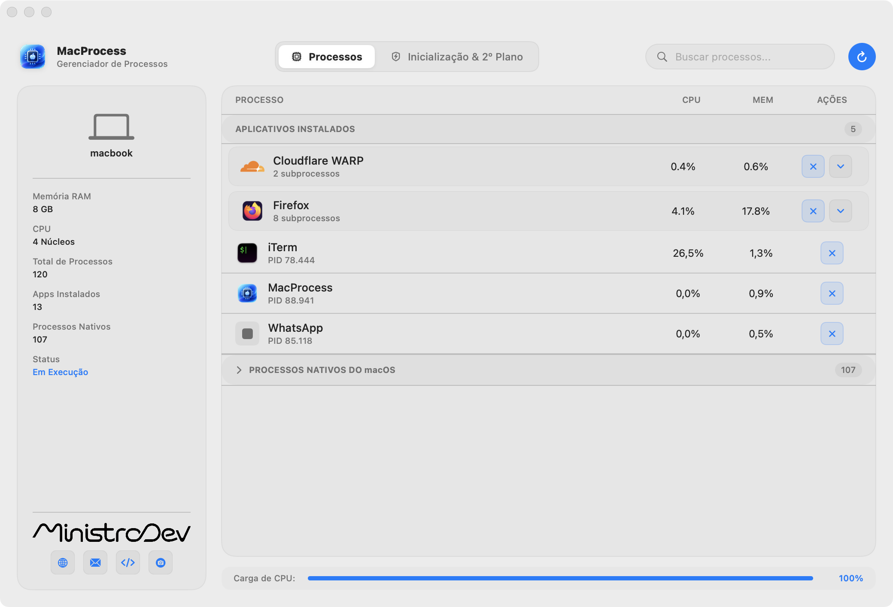

  
  <h1>MacProcess</h1>
  
<strong>Gerenciador de Processos e Controle de Serviços em Segundo Plano para macOS</strong>

  
Software nativo de alta performance desenvolvido com SwiftUI e núcleo em C++17.

  
<strong>Versão atual: 1.0.2</strong>

  

    
    
    
    
  

---

## Visão Geral

O **MacProcess** é uma solução para monitoramento de recursos, inspeção de processos em execução e administração de itens de inicialização no macOS. Projetado para usuários e profissionais que demandam controle preciso sobre o ambiente operacional, a ferramenta elimina complexidades e oferece visibilidade completa sobre o consumo de memória, ciclos de CPU e persistência de serviços em segundo plano.

---

## Interface do Aplicativo

Na versão 1.0.2, a navegação do MacProcess é dividida em quatro abas próprias: **Processos**, **Inicialização & 2º Plano**, **Atualizações** e **Desinstalador**.

  <h4>1. Processos</h4>
  

Monitore CPU e memória, expanda grupos de subprocessos e encerre aplicativos quando necessário.

 

  <h4>2. Inicialização &amp; 2º Plano</h4>
  

Revise itens de inicialização, agentes de sistema e serviços em segundo plano. Os controles permitem alterar somente itens de terceiros identificados pelo app.

 

  <h4>3. Atualizações</h4>
  

Consulte atualizações do macOS, abra os painéis oficiais e inicie a instalação pelo mecanismo nativo do sistema.

 

  <h4>4. Desinstalador</h4>
  

Os aplicativos são ordenados por tamanho. Selecione um deles para localizar o pacote, caches, preferências, dados de suporte e outros itens associados antes de enviá-los à Lixeira.

 

  <h4>5. Resíduos de aplicativos removidos</h4>
  

Abra a tag de resíduos para revisar itens que não possuem aplicativo correspondente instalado. Selecione os itens desejados e veja o espaço total antes de movê-los para a Lixeira.

 

  <h4>Instalador de distribuição</h4>
  

---

## Funcionalidades Principais

### Monitoramento de Processos e Subprocessos
- Inspeção contínua de memória RAM e uso de processador.
- Agrupamento hierárquico inteligente de instâncias e subprocessos pertencentes ao mesmo aplicativo.
- Finalização estruturada de processos com envio sequencial de sinais `SIGTERM` e `SIGKILL` para encerramento forçado sem deixar processos órfãos.

### Administração de Inicialização e Segundo Plano
- Mapeamento direto dos diretórios de serviços do sistema (`~/Library/LaunchAgents`, `/Library/LaunchAgents` e `/Library/LaunchDaemons`).
- Desativação persistente através da integração com o subsistema `launchd` e renomeação controlada dos descritores de configuração.
- Manutenção permanente do estado configurado, preservando as preferências mesmo após a reinicialização do sistema operacional.

### Integridade do Sistema Operacional
- Filtro de segurança integrado para proteção contra encerramento ou desativação acidental de serviços essenciais da Apple (`com.apple.*`).
- Exibição de alertas de status com identificação visual dos aplicativos manipulados.

### Atualizações do macOS
- Consulta das atualizações disponíveis pelo mecanismo oficial do macOS.
- Atalho direto para Atualização de Software e atualizações da App Store.
- Instalação com confirmação e autenticação administrativa nativa quando necessária.
- Status de buscas automáticas e opção para reativá-las com autorização do usuário.

### Desinstalador Completo
- Lista aplicativos de terceiros instalados, ordenados por tamanho.
- Localiza dados associados em Application Support, Caches, Preferences, Logs, estado salvo e Containers.
- Detecta resíduos identificáveis de aplicativos já removidos, apenas dentro da Biblioteca do usuário e excluindo componentes `com.apple.*`.
- Move apps e dados selecionados para a Lixeira, com indicação do espaço recuperado e possibilidade de restauração antes de esvaziá-la.

---

## Requisitos de Sistema

- **Sistema Operacional**: macOS Monterey 12.0 ou superior.
- **Hardware**: Compatibilidade nativa com Apple Silicon (série M) e processadores Intel x86_64.

---

## Instalação

1. Obtenha o instalador oficial na seção de [Releases](https://github.com/ministrodev/macprocess/releases/latest).
2. Abra o arquivo `MacProcess-{versão}.dmg`.
3. Arraste o executável **MacProcess** para a pasta **Aplicativos**.
4. Inicie o aplicativo a partir do Finder, Launchpad ou Spotlight.
   *(Caso o macOS exiba o aviso de desenvolvedor não verificado no primeiro acesso, clique com o botão direito sobre o ícone do MacProcess e selecione "Abrir", ou autorize em Ajustes do Sistema > Privacidade e Segurança).*

---

## Licença

Este projeto é distribuído sob os termos da licença de código aberto **MIT**. O uso pessoal, estudo e modificações são permitidos, desde que o aviso de direitos autorais e a atribuição de créditos ao autor original (**Ministro Developer**) permaneçam incluídos em todas as cópias ou partes substanciais do software.

Para detalhes completos dos termos e condições, consulte o arquivo [LICENSE](LICENSE).

---

## Desenvolvedor

  
    
  
  
<strong>Ministro Developer</strong>

  

    Website: <a href="https://ministrodev.com">ministrodev.com</a> &nbsp;|&nbsp;
    Contato: <a href="mailto:contato@ministrodev.com">contato@ministrodev.com</a> &nbsp;|&nbsp;
    Instagram: <a href="https://instagram.com/ministrodev">@ministrodev</a>
  

